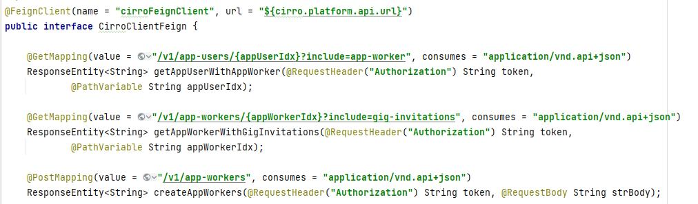
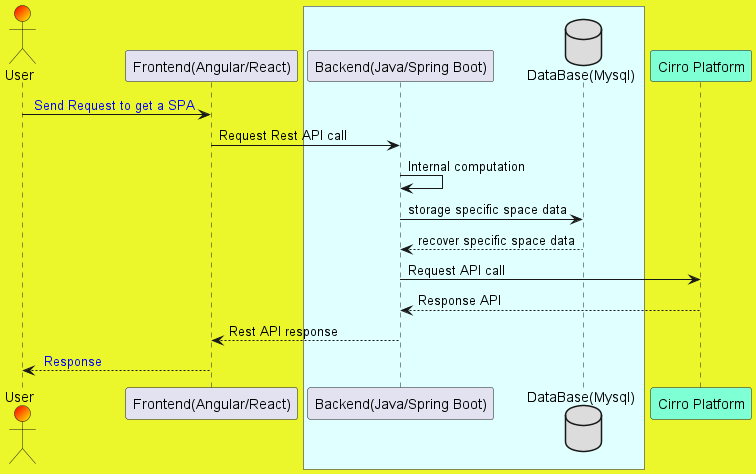

# example-cirro-java-app


The application itself is designed to support HTTPS, despite this, it is configurable and you can change the protocol to simple HTTP and the port number.

The core java application is build up with 3 submodules:

- example-cirro-common
- example-cirro-be
- example -cirro-service

The first module(example-cirro-common) contains all the common objects and utility methods to communicte with the FE applications and with the Cirro Platform.<br>
The second module(example-cirro-be) is devolved to manage the storage and retrieve of specific apllication's data as some user information,translation assignment, translation files and translation results.<br>
Lastly, the third module(example-cirro-service) manages and expose the API used by the FE(Angular/React)applications, it's a kind of controller, interacting with the external systems(Cirro Platform), DB and FE SPA applications. All interactions with Cirro Platform are well specified inside an inerface called `CirroClientFeign`. I carry an example excerpt below:
<br>
<br>



### Requirements
- Java 11
- Spring Boot
- Apache Maven 3.8.4
- Mysql 8.0.27
- Node 18.1.0
- React 17
- Angular 13

### Setup

```bash
git clone https://github.com/test-IO/example-cirro-java-react-app.git
```

The whole project contains 3 applications inside opportunity integrated each other:
- One kind of Connector (Spring Boot)

and 2 FE SPA applications

- React 
- Angular 

To create the relatives jars, simply run the following files for each case, they'll compile automatically the whole executable project respectively for React or Angular.
Note that all the following commands have to be run from root folder of the project

```bash
deploy_angular_prod.bat  # In case of Angular for prod Environment
deploy_angular_dev.bat  #  In case of Angular for dev Environment

deploy_react_prod.bat  #  In case of React for prod Environment
deploy_react_dev.bat  #  In case of React for dev Environment
```

To run a single jar:

```bash
java -jar  -Dprofile=dev  example-cirro-service-0.0.1-SNAPSHOT.jar

java -jar  -Dprofile=prod  example-cirro-service-0.0.1-SNAPSHOT.jar
```
Below is provided an utility to generate access TOKEN to  manually interrogate the Cirro Platform with some client :

```bash
print_token_cirro.bat
```

### Basic Architecture




### Configurations

The project is configured to work in 3 different environments:

- production
- staging
- development

The default path (it's configurable by maven pom) where to place the configuration files is for each configuration:
```
/opt/cirro/config/applications/cirro-java
```

The system needs the following files((We report the case of a development environment but the extensions  can obviously be staging or prod)):

- application-dev.yml # here we have the specific application configuratios as: protocol, port number,authentication parmeters(OAUTH2),datasource,address cirro platform(staging/production)

- logback-dev.xml # To configure logging process output

- cirro_private_key.pem # the private key to interact with the Cirro Platform
- ssl-server.jks # the private key to provide https for the application itself


### OAUTH2 Integration with Cirro Platform

Below are indicated some deatails about the necessary parameters to perform the OAUTH2 with the Cirro Platform:

<pre>
#cirro oauth2 
spring:
  security:
    oauth2:
      client:
        registration:          
          cirro:
            client-name: cirro
            client-id: CLIENT_ID_CIRRO
            client-secret: CLIENT_SECRET_CIRRO
            authorization-grant-type: authorization_code
            redirect-uri:  ${server.domainProtocol}:${server.port}/login/oauth2/code/cirro
            provider: cirro
        provider:
          cirro:
            token-uri: https://staging.cirro.io/oauth/token
            authorization-uri: https://staging.cirro.io/oauth/authorize           
            userInfoUri: https://api.staging.cirro.io/v1/oauth/me
            user-name-attribute: id 
</pre>
and the interaction with cirro API:

<pre>
#for a specific APP registerd on cirro community
token-app-config:
  client-id: CLIENT_ID_CIRRO
</pre>


<br>
<br>
<br>

### DB and User creation scipts:

```sql
CREATE DATABASE DB_NAME;

USE DB_NAME;

CREATE USER 'USER_NAME'@'localhost' IDENTIFIED BY 'PASSWORD';

CREATE USER 'USER_NAME'@'%' IDENTIFIED BY 'PASSWORD';

GRANT ALL PRIVILEGES ON DB_NAME.* TO  'USER_NAME'@'localhost';

GRANT ALL PRIVILEGES ON DB_NAME.* TO  'USER_NAME'@'%';

FLUSH PRIVILEGES;

```
